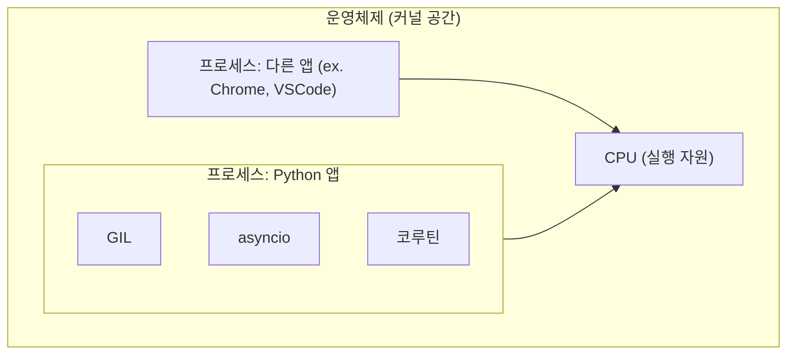

> 운영체제 관점에서 **Python의 async/await가 어떤 흐름 위에서 작동하는 건지** 정리해보려합니다.
> 운영체제에 대한 기본적인 이해(프로세스, 스레드, 스케줄링)를 갖춘 독자를 대상으로 합니다.
{: .prompt-info }

Python의 `async/await`를 처음 접했을 때, “비동기 처리를 위한 문법”이라는 건 알았지만, 실제로 어떤 흐름으로 작동하는지는 명확히 알지 못했습니다.

> "프로세스는 CPU에 올라가야 실행되는데,  
> 내가 작성한 async 함수는 그 CPU 위에서 뭘 어떻게 하고 있는 걸까?"

처음에는 단순히 이렇게 생각했습니다.  

> "아, Python은 GIL(Global Interpreter Lock) 때문에 어차피 한 번에 하나의 스레드만 실행되니까,  
> 그래서 `async`도 CPU 바운드 작업에선 별 효과가 없는 거겠지."

*※ GIL(Global Interpreter Lock)은 Python의 멀티스레딩에서 중요한 개념이지만,  
이 글에서는 async/await와 OS의 흐름 관계에 집중하기 위해 별도로 다루지 않습니다.*

---

- `await`를 만나면 코드 흐름이 바뀐다고? 그럼 진짜 CPU에서 어떤 일이 일어나는 걸까?
- async는 I/O 바운드에 적합하다는데, 왜 CPU 바운드 작업엔 잘 안 맞는 걸까?
- 이건 단지 파이썬 문법의 문제가 아니라, **OS 레벨의 스케줄링과 흐름 관리**의 문제 아닌가?

이 글은 그런 질문들에서 출발합니다.
Python의 async/await를 단순한 문법이 아닌, **운영체제 위에서 작동하는 하나의 흐름 제어 방식**으로 바라보고,
OS와의 비교를 통해 그 구조를 이해해보려는 시도입니다.

---

## 1. 왜 async/await을 운영체제 관점에서 보려는가

많은 개발자들이 Python의 `async/await`을 **단순한 비동기 문법**,  
혹은 **I/O 바운드 작업을 효율적으로 처리하는 방식** 정도로 받아들입니다.

저 역시 처음엔 그렇게 생각했지만, (혹시 저만 그런가요..? 👀)  
어느 순간 이런 질문이 생겼습니다:

> “이 흐름은 운영체제 위에서 어떤 식으로 작동하는 걸까?”

이 글은 그 질문에서 출발해,  
Python의 `async/await` 구조를 **운영체제 관점에서 해석**해보려는 시도입니다.

`await`이 **CPU, 프로세스, 스레드, 타임슬라이스** 등과 어떤 관계가 있는지를 바라보며,  
async의 동작이 실제로 어떻게 이루어지는지 살펴봅니다.

---

### 왜 이런 접근이 필요한가요?

- `await`을 걸면 다른 작업이 실행될 수 있다는데,  
  그 **"다른 작업"은 정확히 어떤 조건에서 가능한가요?**

- `async`는 **싱글 스레드에서 동시성**을 제공한다고 하는데,  
  싱글 스레드에서 "동시성"이란 건 도대체 무슨 의미인가요?

- 그리고 CPU 바운드 작업에서는 `async`가 잘 안 먹힌다는데,  
  **그 이유는 정말 GIL 때문인가요, 아니면 OS 스케줄링과 관련된 건가요?**

---

이 관점은  
- `코루틴`,  
- `이벤트 루프`,  
- `멀티프로세싱`,  
- `멀티코어 실험`  

으로 자연스럽게 이어지며,  
결국엔 이렇게 묻게 됩니다:

> **"내 프로그램은 실제로 CPU 위에서 어떤 흐름으로 실행되고 있는가?"**

---

> 🤓 참고로  
> 이 글에 나오는 코드와 도식은 (비교용 이미지를 제외하면) 모두 **CPU 1개 환경 기준**에서 실행된 결과를 바탕으로 작성했습니다.  
> **가능한 한 실제 출력 로그와 함께 정리**했으며, 환경은 아래와 같습니다:  
> Cloud 환경 – 물리 코어 1개 / 논리 코어 2개  
> 

---

## 2. Python 프로세스 안에서 async는 어디서 돌아가는가
운영체제 입장에서 보면,  
우리가 만든 Python 프로그램은 그저 **하나의 프로세스**일 뿐입니다.  
그 안에서 어떤 코드를 실행하든, 어떤 모듈을 쓰든  
**OS는 전혀 알지 못합니다.**

우리가 작성한 Python 애플리케이션도 결국 운영체제 입장에서는 **하나의 프로세스**일 뿐입니다.  
다른 앱(예: Chrome, VSCode)들과 나란히 놓인 실행 단위 중 하나죠.

그리고 이 프로세스 안에서 Python 런타임이 돌아가고,  
그 내부에서 `asyncio`, `코루틴`, `GIL` 같은 구조가 동작합니다.



즉, 우리가 async def를 만들고 await을 써도 운영체제는 아무것도 하지 않습니다.
**오직 Python 런타임 내부에서만** 실행 흐름이 바뀝니다.

그래서 이걸 **협력적(cooperative) 스케줄링**이라고 부릅니다.
→ await이 없으면, Python은 다른 작업에게 CPU를 양보하지 않습니다.

### 여기까지 정리하면,
우리가 작성한 async/await 코드는 OS가 직접 다뤄주는 구조가 아니고,
그저 **Python 프로세스 안에서 일어나는 흐름 제어일 뿐**이라는 걸 알 수 있습니다.

## 3. async 코드에서 흐름이 바뀐다는 건 무슨 뜻일까?

Python의 `async/await` 구조는  
운영체제가 CPU를 직접 제어하는 구조가 아니라,  
**코드 내부에서 실행 흐름을 스스로 양보하는 방식**입니다.

아래 코드는 그걸 실험해본 코드입니다.

```python
import asyncio
import time

# sleep을 통해 서로 cpu를 양보하며 실행하는 경우
async def yield_task(name, delay):
    for i in range(3):
        print(f"{name}: step {i} at {time.strftime('%X')}")
        await asyncio.sleep(delay)
    print(f"{name} 완료 at {time.strftime('%X')}")

# 양보하지 않고 CPU를 점유하는 경우
async def task(name, delay):
    for i in range(3):
        print(f"{name}: step {i} at {time.strftime('%X')}")
    print(f"{name} 완료 at {time.strftime('%X')}")

async def main():
    await asyncio.gather(
        yield_task("yield_task1", 1),
        yield_task("yield_task2", 1)
    )

    await asyncio.gather(
        task("task1", 1),
        task("task2", 1)
    )

asyncio.run(main())
```
### 🖥 실행 결과 (CPU 1개 환경)


### 코루틴이 서로 번갈아 실행되는 경우 (`await` 사용)

- `yield task1`와 `yield task2`가 시간 단위로 교차하며 실행됩니다.
- `await asyncio.sleep(1)`이 들어간 순간 이벤트 루프가 제어권을 얻고 다른 코루틴을 실행시킵니다.

### CPU를 양보하지 않는 경우 (`await` 없음)

- 실행 로그에서는 `task1`의 모든 step이 먼저 출력되고, 그 뒤에 `task2`의 로그가 출력됩니다.
- 이는 이벤트 루프가 **다른 코루틴을 끼워 넣을 기회를 얻지 못했다는 뜻**입니다.

이를 통해 우리는 `async`가 **단일 스레드에서 여러 코루틴을 빠르게 전환하며 실행**되는 것임을 확인할 수 있습니다.

즉, `await`를 통해 코루틴이 실행 흐름을 양보할 때,
이벤트 루프는 다른 코루틴을 실행시켜 **병렬처럼 보이는 실행 흐름**을 만들어냅니다.
>단, 실제로는 CPU가 동시에 여러 일을 처리하는 게 아니라, 싱글 스레드 안에서 빠르게 전환하는 방식이라는 점을 기억해야 합니다. 

## 4. CPU 바운드 작업도 흐름을 양보할 수 있을까?

async는 I/O 바운드 작업에 최적화된 구조입니다.  
그런데 CPU를 오래 점유하는 작업에서도 중간에 흐름을 나눌 수 있을까요?

결론부터 말하면 **"가능은 하지만, 협조가 필요합니다."**

---

아래 예제는 CPU를 계속 점유하는 작업 안에 일정 조건마다 `await asyncio.sleep(0)`을 넣어 **다른 코루틴에게 실행 기회를 넘겨주는 구조**입니다.

```python
import asyncio
import time

async def cpu_heavy(name, delay):
    print(f"{name}: start at {time.strftime('%X')}")
    for i in range(10**8):
        if i % 2_000_000 == 0 :
            # 이 지점에서 흐름을 양보해 이벤트 루프가 다른 코루틴을 실행할 수 있게 해준다.
            await asyncio.sleep(0)
    print(f"{name}: end at {time.strftime('%X')}")

async def io_task(name, delay):
    print(f"{name} started at {time.strftime('%X')}")
    await asyncio.sleep(delay)
    print(f"{name} finished at {time.strftime('%X')}")

async def main():
    await asyncio.gather(
        cpu_heavy("cpu_heavy_task", 1),
        io_task("io_task", 1)
    )

asyncio.run(main())
```
### 🖥 실행 결과 (CPU 1개 환경)


여기서 중요한 포인트 `await asyncio.sleep(0)`은 **"다른 코루틴이 있다면 실행 기회를 양보하겠다"**는 뜻입니다.

즉, Python은 이 지점에서 이벤트 루프에게 제어권 넘기고, 
다른 코루틴을 실행시킬 수 있는 기회를 제공합니다.

덕분에 CPU를 혼자 독점하지 않고,
다른 작업과 실행 흐름을 나눌 수 있는 구조가 됩니다.

하지만 주의할 점도 있습니다. 
너무 자주 await을 만나면 오히려 성능이 저하될 수 있습니다.
매번 흐름을 양보할 때마다 context switch 비용이 발생하기 때문입니다.

---

### 흐름 양보 없이 순수 CPU 작업만 수행하는 경우

```python
import asyncio
import time

async def cpu_heavy(name, delay):
    print(f"{name}: start at {time.strftime('%X')}")
    for i in range(10**8):
        pass
    print(f"{name}: end at {time.strftime('%X')}")

async def io_task(name, delay):
    print(f"{name} started at {time.strftime('%X')}")
    await asyncio.sleep(delay)
    print(f"{name} finished at {time.strftime('%X')}")

async def main():
    await asyncio.gather(
        cpu_heavy("cpu_heavy_task", 1),
        io_task("io_task", 1)
    )

asyncio.run(main())
```

### 🖥 실행 결과 (CPU 1개 환경)
\
이 결과를 보면,
오히려 `await`로 흐름을 나눈 첫 번째 예제보다
총 소요 시간이 짧았다는 점을 확인할 수 있습니다.

결국 async는 “병렬 처리 도구”가 아니라
**“동시성을 협력적으로 제어하는 방식”**이라는 점이 핵심입니다.

---

## 5. CPU 바운드 작업에는 결국 멀티프로세싱?

async는 I/O 바운드 작업에 잘 맞지만,  
CPU를 오래 점유하는 작업에는 큰 도움이 되지 않습니다.

그 이유는 간단합니다.  

>**async는 흐름을 넘겨주는 방식일 뿐,  
>하나의 CPU를 더 효율적으로 쓰게 해주는 구조는 아니기 때문입니다.**

---

Python에서는 GIL(Global Interpreter Lock) 때문에  
**멀티스레딩으로는 CPU를 병렬로 사용할 수 없습니다.**

그래서 진짜 CPU를 병렬로 쓰고 싶다면  
**멀티프로세싱**을 사용해야 합니다.

멀티프로세싱은  
- 운영체제가 직접 여러 프로세스를 관리하고  
- 각 프로세스를 서로 다른 CPU 코어에 배분할 수 있습니다.

---

### 💡 그럼 멀티코어가 아니면?

맞습니다.  
**멀티코어가 아니면, 멀티프로세싱도 사실상 동시에 실행되는 건 아닙니다.**

하지만 운영체제는 각 프로세스에 **타임슬라이스를 배분**해서  
각각이 돌아가듯 보이게 만들 수는 있죠.  
(바로 그게 OS 스케줄링이 하는 일입니다)

---

### ✅ 정리하자면

| 처리 방식       | 구조         | CPU 바운드에 적합? | 병렬성 |
|----------------|--------------|--------------------|--------|
| async/await    | 단일 프로세스 내부 흐름 전환 | ❌        | ✕ (동시성만 있음) |
| 멀티스레딩     | Python에서는 GIL 때문에 제한 | ❌        | ✕ |
| 멀티프로세싱   | OS가 여러 프로세스를 스케줄링 | ✅        | ⭕ (멀티코어에서 효과적) |

---

그래서 Python에서  
> **I/O 바운드 작업 → `async/await`**,  
> **CPU 바운드 작업 → `multiprocessing`**  
으로 처리하는 게 일반적인 전략입니다.


## 🧪 실험: 멀티코어 vs 싱글코어 환경에서 멀티프로세싱 성능 차이

Python에서 CPU 바운드 작업을 `multiprocessing`으로 처리했을 때,  
**CPU 코어 수에 따라 실제 실행 시간이 어떻게 달라지는지** 실험해보았습니다.

### 💻 실험 환경

> Local : 물리코어 4, 논리코어 8\
>\


| 항목             | Cloud 환경                | Local PC 환경           |
|------------------|---------------------------|-------------------------|
| CPU 코어 수       | 물리코어 1,논리코어 2      | 물리코어 4, 논리코어 8   |
| OS               | Ubuntu 24.04.1 LTS        | Ubuntu 24.04.2 LTS      |
| Python 버전       | 3.12.3                    | 3.12.3         |

테스트 조건은 다음과 같습니다:

| 항목           | 값                |
|----------------|-------------------|
| 프로세스 수     | 2개 고정           |
| 각 프로세스 작업 | 1억 루프 반복       |
| 비교 변수       | CPU 코어 수 (1 vs 4) |

---

### 🧾 테스트 코드
```python
import multiprocessing
import time

def cpu_bound_task(n):
    count = 0
    for i in range(10 ** 8):
        count += i
    return count

if __name__ == "__main__":

    print(f"start at {time.strftime('%X')}")
    start = time.time()

    processes = []
    # 프로세스 수를 고정하여, 코어 수에 따른 실행 시간 차이를 관찰
    process_count = 2
    print(f"process_count : {process_count}")
    for _ in range(process_count):
        p = multiprocessing.Process(target=cpu_bound_task, args=(1,))
        processes.append(p)
        p.start()

    for p in processes:
        p.join()

    print(f"end at {time.strftime('%X')} 소요 시간: {time.time() - start:.2f}초")
```
### 🖥 실행 결과 
- 멀티코어 환경
\

- 싱글코어 환경
\

---

| 환경 | 평균 소요 시간 |
|------|----------------|
| 멀티코어 (물리4, 논리 8개) | 약 5.24초 |
| 싱글코어 (물리1, 논리 2개) | 약 35.85초 |

> 동일한 작업(1억 루프 × 2개 프로세스)을 실행했음에도 불구하고,  
> **멀티코어 환경에서는 병렬로 처리되면서 실행 시간이 크게 단축**된 것을 확인할 수 있습니다.

---

## ✅ 이제는 이 질문에 이렇게 대답할 수 있습니다

### ❓ `await`을 걸면 다른 작업이 실행될 수 있다는데?
  → **맞습니다. 단, 그 코루틴이 자발적으로 양보(`await`)할 때만**,  
  Python 런타임의 **이벤트 루프가 다른 대기 중인 코루틴을 실행**할 수 있습니다.
  이는 **협력적(cooperative) 멀티태스킹 구조**입니다.

### ❓ `async`는 싱글 스레드에서 동시성을 제공한다고?
  → **동시성은 "진짜 동시에"가 아니라**,  
  **CPU를 쓰지 않는 I/O 작업 중의 대기 시간을 활용해, 다른 작업을 잠깐 끼워 넣는 구조**입니다.  
  이는 **코루틴 간의 협력(cooperative multitasking)**으로 이루어집니다.

### ❓ CPU 바운드 작업에서 `async`는 왜 효과가 없나요?
  → **단순히 GIL 때문만은 아닙니다.**  
  애초에 `async`는 **CPU 점유 시간 자체를 줄여주는 구조가 아니며**,  
  코루틴이 흐름을 **양보하지 않으면**, 이벤트 루프도 다른 작업을 끼워 넣을 수 없습니다.  
  따라서 CPU 바운드 작업에는 **운영체제 수준의 병렬 처리, 즉 멀티프로세싱이 필요**합니다.


이제는 `async/await`이 단순한 문법이 아니라,  
**운영체제 위에서 돌아가는 사용자 코드 흐름의 설계이자 선택**이라는 걸  
명확히 말할 수 있게 되었습니다.

---

## ✍️ 마무리하며

이 글은 async 문법을 소개하는 글이 아닙니다.  
운영체제 관점에서, 그리고 CPU와의 관계를 기준으로  
Python의 async/await가 어떤 의미를 가지는지를 이해하려는 시도였습니다.

---

처음엔 단순히  
> "await하면 멈추고, 그 사이 다른 거 하는 거 아냐?"  
정도로만 알고 있었던 개념이,

실제로는  
> “CPU가 누구에게 실행 시간을 줄 것인가”,  
> “그 실행 시간 안에서 내가 어떤 흐름을 만들어낼 수 있는가”  
라는 더 깊은 질문으로 이어졌습니다.

---

이 질문을 따라가며 저는 아래의 사실들을 확인하게 되었습니다:

- async는 **운영체제가 제어하는 흐름이 아니라**,  
  **사용자 코드 안에서의 협력적인 흐름 전환**이라는 점,
- CPU 바운드 작업은 async로 해결할 수 없고,  
  **운영체제가 직접 스케줄링하는 멀티프로세싱**이 필요하다는 점,
- 그리고 **멀티코어 환경이 진짜 병렬 처리의 핵심**이라는 걸  
  직접 실험을 통해 확인할 수 있었습니다.

비동기 프로그래밍은 단순한 문법이 아니라,  
**운영체제 위에서 돌아가는 코드의 본질을 이해하는 방법**일지도 모릅니다.

---

> 이 글은 처음 `async`와 `await`이 진짜 뭔지 궁금했던  
> 저 스스로의 질문에서 출발한 기록입니다.  
> 알아본다고 이리저리 파보긴 했지만...
> 저도 틀릴 수 있습니다! **피드백은 언제든 환영입니다.**