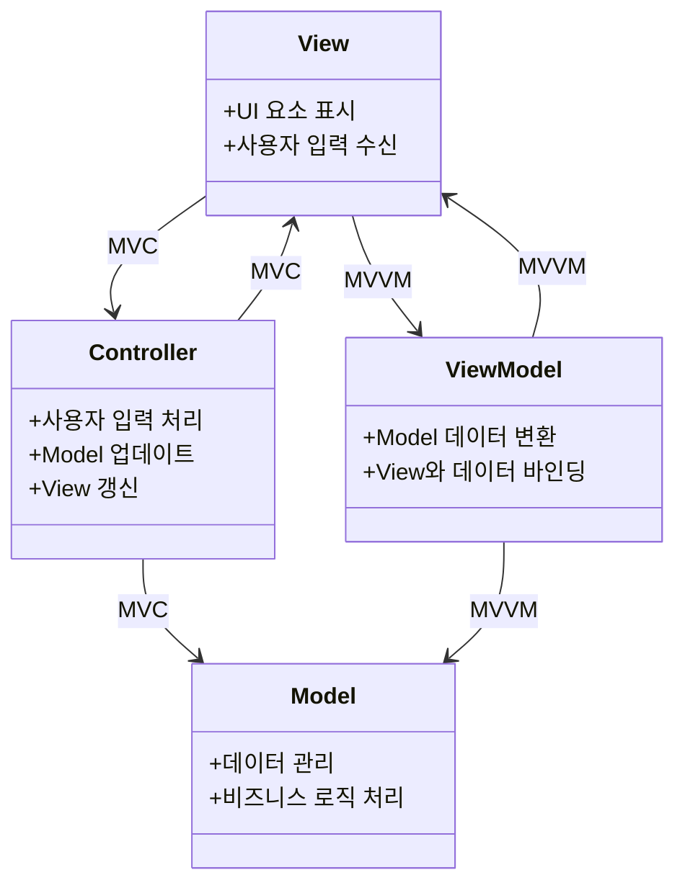

> 비주류 프레임워크에서 구조를 읽어본 관찰일지입니다. 
{: .prompt-info }

## 1. JSP만 하다 처음 만난 프론트 프레임워크 — 그리고 3년 후

웹 개발을 처음 배울 땐 JSP로만 작업했다.  
프론트엔드 프레임워크라는 건, 그때까지만 해도 나와는 먼 이야기였다.  
실무에서 처음 `extJS`를 마주하였다.  
그 안에 있는 구조들 — `MVVM`, `ViewModel`, `store` — 전부 생소했다.  

처음에는 그냥  
> “store? 영어 뜻 그대로 데이터 저장하는 곳?”  
하고 지나쳤다.  
그 구조를 ‘해석’해볼 생각은 아예 없었다.

그게 벌써 3년 전이다.  
최근에는 JSP와 함께 쓰인 Dojo 기반 레거시 프레임워크를 분석하다가,  
문득 **현재 쓰는 프레임워크의 구조를 다시 들여다보고 싶어졌다.**

그땐 무심히 넘겼지만, 지금은  
**“정말 이 구조가 MVVM이라고 할 수 있을까?”**  
**“Controller에서 직접 store를 조작한 그 판단은, 구조적으로 의미 있었던 흐름이었을까?”**  
라는 질문이 생겼다.

> 이 글은 extJS의 패턴을 깊이 있게 분석하거나  
> 리팩터링을 제안하려는 글이 아니다.  
> **단지 내가 실무 중 마주쳤던 구조를  
> 지금 시점에서 다시 읽어보고,  
> 납득 가능한 흐름이었는지를 정리해보려는 기록이다.**

## 2. 처음엔 MVVM이라길래 그런 줄 알았다

extJS는 MVVM 구조를 따른다고 설명되어 있었다.  
View, ViewModel, Controller, Store — 문서도 구조도 그 틀을 따른다.  
[공식문서](https://docs.sencha.com/extjs/7.8.0/guides/application_architecture/application_architecture.html)  
  
당시에는 까마득한 선배 개발자께서 **“이건 MVVM 구조로 짜여 있다”**고 설명하셨고,  
실제로 ViewModel 파일도 있었기 때문에 **“아 그렇구나”** 하고 받아들였다.  

그런데 막상 작업을 하다 보면 **Controller가 계속 등장해서 상태를 제어**하고,  
store도 직접 다루고 있어서 “이게 MVVM 맞나…?” 하는 의문이 들었다.  

그렇다고 `MVC`라고 단정 지을 자신도 없었고,  
나보다 훨씬 경험 많은 분이 설명하신 구조이기도 해서  
그냥 “아 그런가보다” 하고 받아들인 채 코드를 쓰고 있었다.  

그리고 지금에서야, 그때 느꼈던 어색함이 구조적인 판단의 시작이었구나 싶다.

### MVVM vs MVC 구조 비교

MVVM과 MVC의 핵심 구조 차이를 표로 정리하면 다음과 같다:

| 패턴 | View 역할                   | Controller 역할           | ViewModel                 | Store               | 상태 변경 방식            |
| ---- | --------------------------- | ------------------------- | ------------------------- | ------------------- | ------------------------- |
| MVVM | 사용자 입력 수신 및 UI 표시 | 없음 또는 최소화됨        | 상태 관리 중심            | 핵심 계층           | 바인딩을 통한 자동 동기화 |
| MVC  | 사용자 입력 수신 및 UI 표시 | 로직 중심, 상태 직접 처리 | 없음 또는 형식적으로 존재 | 없음 또는 직접 사용 | Controller가 직접 조작    |

두 구조의 실제 구성 관계는 흐름 중심으로 보면 더 잘 이해된다:  



## 3. 이건 상태 변경인가? UI 흐름 제어인가?

당시 나는 MVVM 구조라고 들었기 때문에,  
Controller에서 store를 직접 조작하는 게  
뭔가 잘못된 흐름처럼 느껴졌었다.  
그래서 이 동작이 정말 상태 변경을 의미하는 건지,  
아니면 단순한 UI 흐름 제어인지 계속 고민하게 됐다.  


```javascript
this.lookupReference('myCombo').getStore().loadData([
  { value: '', label: '선택하세요' },
  ...apiResponse
]);
```  
해당 코드는 comboBox에 '선택하세요'라는 mock 값을 넣는 기능이었다.  
이 값은 서버에서 오는 실제 데이터가 아니었고,  
사용자 친절을 위한 프론트엔드 임시 데이터였다.  
나는 이걸 **도메인 상태의 일부가 아니라, UI 흐름을 위한 표시**라고 판단했다.

결과적으로 지금 다시 보면,  
이 구조는 **MVVM보다는 MVC에 가까웠고**,  
Controller가 이런 데이터를 직접 주입하는 건  
그 자체로 이상한 게 아니었다.  
오히려 **이 타이밍에서 판단하고 값을 넣는 게 구조적으로 더 명확한 책임 분리**였을 수도 있다는 생각이 들었다.  

그 당시에는 **구조에 대한 확신도 없고**,  
설계 기준도 온전히 이해하지 못했지만,  
그런 **작은 위화감이 구조를 납득하려는 시도**로 이어졌다.  

당시에는 mock 데이터를 넣는 로직이 `afterrender` 시점에 정의되어 있었는데,  
그게 왜 거기 있는지도 모르고, 그냥 “그런가 보다” 하고 넘겼다.

_기억을 바탕으로 재구성한 코드입니다_
```js
listeners: {
    afterrender: function () {
        const store = this.lookupReference('myCombo').getStore();
            store.loadData([
            { value: '', label: '선택하세요' },
            ...apiResponse
        ]);
    }
}
```

하지만 지금 다시 보면,  
렌더링 이후 시점에서 mock 데이터를 넣는 방식은  
- UI가 준비된 이후에 값을 주입하고  
- 서버 데이터와 사용자 경험용 mock 데이터를 분리하며  
- 흐름상 더 깔끔한 구조를 만들고 있었다.  

당시에는 controller가 직접 store를 조작하는 게 어색하게 느껴졌지만,  
**코드 흐름 자체는 이해 가능한 선**에서 움직이고 있었기 때문에  
그냥 “MVVM이 원래 이렇게 쓰이는 건가 보다” 하고 받아들였었다.  

## 4. 구조를 해석해보니, Controller가 ViewModel이었다

프로젝트 전반을 다시 들여다보면 확실했다.  
ViewModel은 존재하긴 했지만, 대부분의 흐름은 Controller가 다루고 있었다.  
Controller는 View와의 이벤트 연결, 상태 판단, store 조작까지 모두 관여했다.  
결국 ViewModel은 형식적으로 존재했을 뿐,  
실제로는 **Controller가 ViewModel 역할까지 떠맡고 있는 구조**였다.  

결국 이 구조는 엄밀한 의미에서 MVVM이라고 보긴 어려웠고,  
오히려 MVC를 중심에 두되,  
ViewModel이 일부 남아 있는 구조 —  
즉, **“MVC에 MVVM을 살짝 곁들인 형태”**에 가까웠다.  

### ViewModel 
_기억을 바탕으로 재구성한 코드입니다_
```js
    data: {
        visibleYn: 'Y'
    },
    formulas: {
        isVisible: function(get) {
            return get('visibleYn') === 'Y';
        }
    }
```

### View
_기억을 바탕으로 재구성한 코드입니다_
```js
items: [{
    xtype: 'component',
    bind: {
        hidden: '{!isVisible}'
    }
}]
```

## 5. 내가 맡고 있는 역할과 구조 감각

나는 웹 애플리케이션을 개발하는 팀에서  
**기능 단위로 프론트와 백엔드를 모두 담당하는 풀스택 개발자**로 일하고 있다.  
팀 구조상 하나의 요청이 오면 화면부터 API, 도메인 로직, DB까지  
**수직 계층 전체를 내가 처리하는 흐름**이다.  
그래서 구조를 볼 때 기술 계층별로 나누기보다는,  
**기능 흐름 단위로 책임과 위치를 판단**하게 된다.

프론트든 백엔드든, 사실 실무에서는  
때로는 깊이 있게 파고들고,  
때로는 별 생각 없이 기존 코드를 복붙하면서 처리할 때도 많다.  
그런데 어느 날 문득,  
**“이 코드는 왜 여기 있어야 했을까?”**,  
**“이 흐름은 구조적으로 말이 되는가?”**  
라는 질문이 들었던 순간이 있었다.  
이 글은 그런 흐름 안에서,  
**내가 실제 맡은 코드 안에서 구조를 어떻게 해석하게 되었는지를 정리해본 기록**이다.  

## 6. 마무리

나는 남이 만들어 놓은 코드를  
그 안에 담긴 흐름과 판단을 읽어보려 했다.  

그 과정에서, MVVM이라고 전달받았지만  
실제로는 MVC에 가까웠던 구조임을 스스로 판단하게 되었다.  

**“이 구조는 왜 이렇게 돼 있었을까?”**,  
**“그 판단은 내가 납득할 수 있었는가?”**,  
**“그 판단에 내가 책임질 수 있을 정도로 이해했는가?”**  
이 질문들을 해보는 과정 자체가  
내가 구조를 ‘따라가는 사람’에서  
**구조를 ‘판단할 줄 아는 사람’으로 옮겨가는 첫걸음**이었다.
  
> 앞으로도 내가 겪는 구조 속 위화감 하나하나를  
> 이런 식으로 다시 읽어볼 수 있다면,  
> 이 기록은 나에게 꽤 의미 있는 나침반이 되어줄지도 모른다.  

> 다른 관점이나 피드백은 언제나 환영합니다.  
