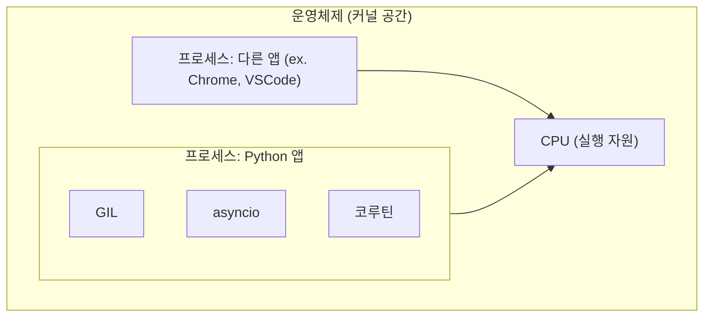

```mermaid
flowchart TB
  subgraph OS["운영체제 (커널 공간)"]
    subgraph PYPROC["프로세스: Python 앱"]
      GIL["GIL"]
      LOOP["asyncio"]
      CORO["코루틴"]
    end

    OTHERPROC["프로세스: 다른 앱 (ex. Chrome, VSCode)"]
    CPU["CPU (실행 자원)"]
  end

  PYPROC --> CPU
  OTHERPROC --> CPU

```
