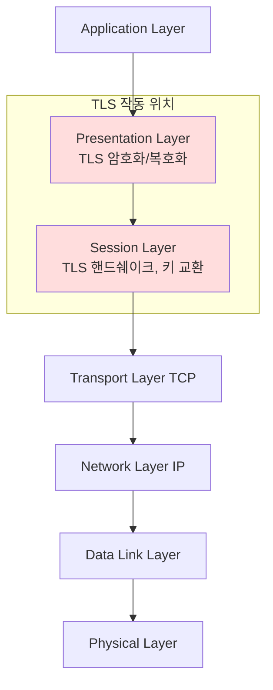
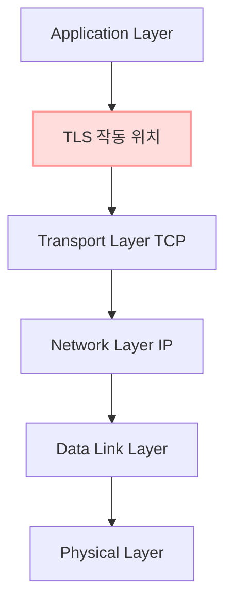
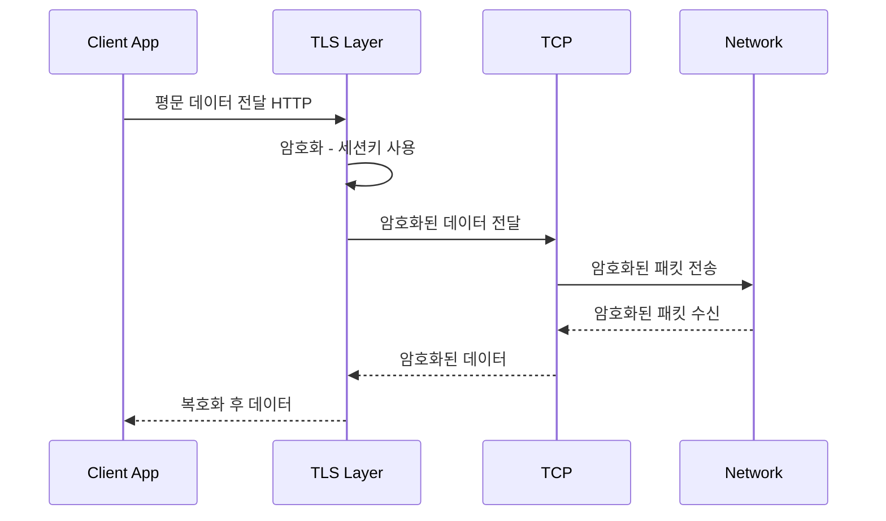
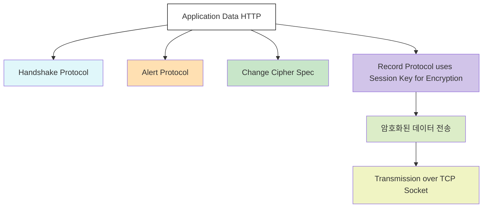

> **애플리케이션 단과 전송 계층 사이에서 암호화가 이루어지는 TLS, 왜 네트워크 보안이라고 불릴까?**  
{: .prompt-info }

---

## ✅ TLS는 왜 네트워크 보안이라고 불리는가?

최근 보안 공부를 하면서 TLS를 **"네트워크 보안"**이라고 하는 것에 혼란을 겪었습니다.

TLS(Transport Layer Security)는 직역하면 **'전송 계층 보안'**입니다.  
하지만 사람들은 흔히 TLS를 설명할 때,  
**네트워크 암호화** 또는 **네트워크 보안**이라는 용어를 사용합니다.  

저는 처음 이 용어를 듣고 IPsec처럼  
**네트워크 계층에서 동작하며 장비 수준의 암호화처럼 느껴지는 프로토콜**을 떠올렸습니다.

그래서 **TLS가 정확히 OSI 모델의 어느 계층에서 작동하는지부터 명확히 이해할 필요가 있었습니다.**  

---

## 🧱 OSI 모델에서 TLS의 위치

TLS는 OSI 7계층 모델의 **세션 계층 5계층**과 **표현 계층 6계층** 사이에서 작동하는 것으로 알려져 있습니다.  
실제로 TLS는 **HTTPS 등 애플리케이션 프로토콜 아래, TCP 전송 계층 위에 위치합니다.**

처음 이 내용을 접했을 때 헷갈렸던 이유는,  
**"네트워크 암호화"**라는 표현이 라우터 같은 3계층 장비에서 암호화가 이루어진다고 오해하게 만들었기 때문입니다.  
하지만 실제로 **TLS는 네트워크 장비가 아니라, 내 로컬 컴퓨터에서 암호화를 시작합니다.**

---

## ⚙️ 실무 TCP/IP 관점에서 본 TLS의 위치

현대 네트워크는 **TCP/IP 4계층 모델** 중심으로 동작합니다.  
TLS는 **TCP 위에서**, 즉 **Application Layer와 Transport Layer 사이에서 동작**합니다.  
**애플리케이션이 TLS를 직접 사용**합니다.

---

## 🔐 TLS 암호화의 원리

TLS는 애플리케이션이 데이터를 보내기 전에,  
**로컬에서 인증서를 통해 합의된 세션 키 Session Key를 이용해 데이터를 암호화**합니다.  
이후 이 **암호화된 데이터가 TCP 패킷에 실려 네트워크를 통해 전송**됩니다.

학원에서 해당 부분에 대해 기술사님께 여쭤봤을 때, 이를  
> **"애플리케이션과 TCP 사이에 암호화된 터널을 형성한다"**  
라고 표현하셨습니다.

이 표현은 이해를 돕는 데 효과적이지만,  
실제 구조상 **TLS는 암호화된 데이터를 생성하여 TCP 위에 실어 보낼 뿐이며**,  
**실제로 물리적인 터널을 만드는 것은 아닙니다.**

네트워크 중간의 라우터는 
**암호화된 패킷을 목적지까지 전달할 뿐, 그 안의 내용을 볼 수 없습니다.**

---

## 📦 TLS 내부 구조 – Record Protocol 기반 흐름

> ※ 아래 도식은 TLS의 **실제 실행 순서가 아닌**, 구성 요소 간 **관계**를 단순화하여 표현한 것입니다.

---

## 📌 그렇다면 왜 TLS가 네트워크 보안인가?

TLS를 **"네트워크 보안"**이라 부르는 이유는  
데이터가 **네트워크를 통과하는 모든 구간에서 암호화된 상태로 보호**되기 때문입니다.  

TLS는 네트워크 장비에서 직접 데이터를 암호화하지 않지만,  
**이미 암호화된 데이터가 전송**되기 때문에 중간에서 데이터를  
**도청하거나 변조하는 공격을 어렵게** 만듭니다.

즉, TLS는 실제 장비가 아니라 **애플리케이션 수준에서 암호화를 수행**하지만,  
결과적으로는 **네트워크 전체를 지나는 동안 데이터를 보호**하기 때문에  
관습적으로 **네트워크 보안(암호화)**이라고 불리게 된 것입니다.

---

## ✅ 결론

이번에 TLS를 명확히 이해하면서 다음과 같은 결론을 얻었습니다.

- TLS는 애플리케이션과 TCP 사이에서 데이터를 암호화하여,  
  **네트워크를 안전하게 통과하게 만듭니다.**  
  흔히 "터널"로 비유되지만, 실제로는  
  **로컬에서 암호화된 데이터를 TCP에 실어 네트워크에 전송하는 구조**입니다.

- TLS가 **네트워크 보안**이라고 불리는 이유는  
  **네트워크의 모든 구간에서 데이터가 안전하게 보호되기 때문**입니다.

- **네트워크 보안**이라는 용어는  
  **암호화를 적용하는 위치**가 아니라,  
  **네트워크를 지나는 동안 데이터를 보호하는 효과**에 초점을 두고 있습니다.

> 실제로 TLS 인증서 만료 이슈로 교체 작업을 직접 진행한 적이 있었고,  
> 그 경험 덕분에 이 구조의 중요성을 실무에서 체감할 수 있었습니다.
