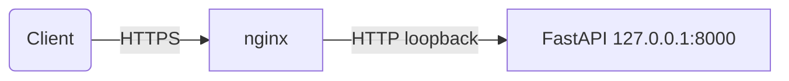

> Oracle Cloud 서버 방화벽 설정 - 클라우드와 OS
{: .prompt-info }

## 인스턴스에 포트를 열기 위한 보안 설정

Oracle Cloud에서는 VM 인스턴스를 만들었다고 해서  
바로 외부에서 접속이 가능한 상태는 아니다.  

실제로 포트가 열리기 위해선  
**보안 규칙(Security List)** 에 명시적으로 포트를 열어주어야 한다.

나는 기본으로 생성된 **Default Security List**는 그대로 두고,  
fastapi 규칙을 직접 추가했다.

### 내 서버의 Ingress Rule 구성

  
  


| Source CIDR | Protocol | Source Port Range | Destination Port |
|:--|:--|:--|:--|
| TCP | 80 (HTTP) | All | 0.0.0.0/0 |
| TCP | 443 (HTTPS) | All | 0.0.0.0/0 |

> 💡 `0.0.0.0/0`은 모든 IP에서의 접근을 허용한다는 뜻이다.  
> `Source Port Range`가 **All**인 이유는,  
> 클라이언트(브라우저, HTTP 요청 등)는 **임의의 ephemeral port (보통 1024~65535 범위)**에서 요청을 보내기 때문이다.  
> 서버는 80, 443처럼 목적지가 고정되지만, **요청자의 출발 포트는 예측할 수 없으므로 All로 열어야 한다.**

## 클라우드 방화벽 설정만으로 충분하지 않다?

OCI 보안 리스트에서 포트를 열었는데도 접속이 안 되는 경우가 있다.  
나도 포트 80, 443을 열어놨지만 아무 응답이 없었다.

원인은 서버 내부의 **리눅스 방화벽, 즉 `iptables`** 설정 때문이었다.

## Ubuntu iptables 설정

iptables의 유용한 커맨드 모음:

```bash
sudo iptables -L --line-numbers

# input 체인의 정책 확인
sudo iptables -L INPUT --line-numbers -n

# 정책 번호로 삭제
sudo iptables -D INPUT 5

# 80 Port 뚫기 
# input체인 5번째 rule을 세팅한다. 
# ens3 인터페이스로 들어오는 트래픽에만 적용한다. (ens3는 ip addr로 확인 가능)
# 프로토콜이 TCP인 경우 TCP 모듈을 사용, 목적지 포트 443인 경우 연결 상태 기반 매칭 모듈 사용(state)
# 새 연결 요청이거나 이미 설정된 연결일 경우에만 허용
sudo iptables -I INPUT 5 -i ens3 -p tcp --dport 443 -m state --state NEW,ESTABLISHED -j ACCEPT
sudo iptables -I INPUT 5 -i ens3 -p tcp --dport 80 -m state --state NEW,ESTABLISHED -j ACCEPT
# 나는 5번째 위치에 삽입하였지만, 룰은 위에서부터 순차로 동작하므로 주의

```

iptables 명령어를 통해 80, 443을 뚫어주고 시도해보면 연결이 될 것이다.

## Nginx로 리버스 프록시 구성

지금 내 서버는 이렇게 구성되어있다.

FastAPI는 외부에서 직접 접근하지 않고,  
**Nginx가 대신 클라이언트의 요청을 받아 내부에서 FastAPI로 전달하는 구조**로 구성했다.



```nginx
# FastAPI 리버스 프록시 (www.inye.cloud 전용)
server {
    listen 443 ssl;
    server_name www.inye.cloud;

    ssl_certificate /etc/letsencrypt/live/inye.cloud/fullchain.pem;
    ssl_certificate_key /etc/letsencrypt/live/inye.cloud/privkey.pem;
    include /etc/letsencrypt/options-ssl-nginx.conf;
    ssl_dhparam /etc/letsencrypt/ssl-dhparams.pem;

    add_header Strict-Transport-Security "max-age=63072000; includeSubDomains; preload" always;

    location / {
        proxy_pass http://127.0.0.1:8000;
        proxy_set_header Host $host;
        proxy_set_header X-Real-IP $remote_addr;
        proxy_set_header X-Forwarded-For $proxy_add_x_forwarded_for;
        proxy_set_header X-Forwarded-Proto $scheme;
    }
}
```

해당 nginx 설정에 대해 설명하자면, 
1. www.inye.cloud:443으로 들어온 요청은 http://127.0.0.1:8000 (FastAPI WAS)로 전달된다. 
2. FastAPI는 외부에 직접 노출되지 않는 구조이다.  
3. add_header HSTS를 통해 이 사이트는 HTTPS로만 접속하라는 보안을 강제하였다. 

> Prerequisite : Gunicorn은 127.0.0.1:8000으로 띄워지도록 systemd에 등록되어있어야한다.  
> certbot을 통해 Let's Encrypt에서 인증서를 받으면, Nginx 설정에 TLS 관련 `ssl_certificate`, `ssl_certificate_key` 경로가 자동으로 추가된다.

현재는 단일 서버 환경이기 때문에 Nginx와 FastAPI 간 통신은 HTTP로도 충분하다.  
그러나 분산 구조에서 Nginx가 프록시 서버 역할만 수행하고,  
실제 WAS가 별도의 서버에 위치한다면,  
Zero Trust 모델에서는 내부 통신도 신뢰하지 않기 때문에,  
**HTTPS (또는 mTLS)로 암호화하는 것이 권장된다.**

---

다음 글에서는 **Cloudflare Access를 통해 OTP 기반 이메일 인증 게이트를 구성한 과정**을 정리할 예정이다.  
초기에는 Full(strict) 모드를 설정하지 않아 무한 리디렉션 문제가 발생했고,  
`www.inye.cloud`에서는 그냥 접속이 되었지만, `inye.cloud`에서는 인증을 요구하는 차이도 있었다.

이런 설정 이슈들을 어떻게 해결했는지,  
Cloudflare에서의 인증 정책을 실제로 어떻게 적용했는지를 중심으로 다음 편에서 이어가겠다.
